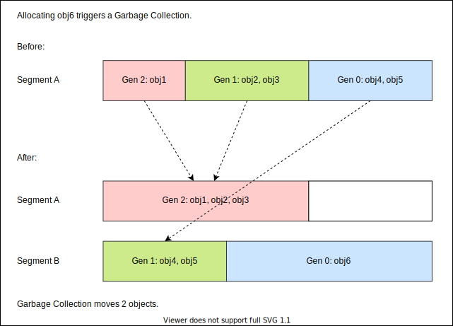

# .NET Garbage Collection
## Fundamentals of .NET Garbage Colleciton

---

### Writing High-Perforamnce .NET Code

* by Ben Watson 
* [www.writinghighperf.net](https://www.writinghighperf.net)

> _In .NET, you need to think of memory performance at least as much as CPU performance. It is so fundamental to smooth .NET operation, that the most significant chunk of this book’s content is dedicated to just this topic._ - Ben Watson, Writing High-Perforamnce .NET Code

---

### Heaps

Heap = Process memory reserved for allocation of data.

A mangaged process has 2 kinds of heaps:

* __Native Heap__: 
used by Windows & CLR for unmanaged memory: Windows API, OS data structures, the CLR itself

* __Managed Heap__  (_GC Heap_): 
used by the CLR to allocate objects subjected to garbage collection

---

### The Managed Heap

The Managed Heap is devided in 2 sections.

* __Small Object Heap (SOH)__
for objects < 85000 bytes, most of all objects

* __Large Object heap (LOH)__
for objects >= 85000 bytes, mostly arrays and strings

Size of an empty object: 16 bytes (32bit), 32 bytes (64bit).
Actually its 12 bytes and 24 bytes but the memory manager can't handle that very well.

---

### The Small Object Heap

The Small Object Heap is divided in 3 generations.

* __Gen 0__ the 1st genertaion
* __Gen 1__ the 2nd generation (serves as cache for Gen 2)
* __Gen 2__ the 3rd and last generation

Once in Gen 2, objects stay here till they _die_.

Objects are _alive_ as long as they are referenced by a __GC root__, e.g. static variables, managed threads or pinned handles.

---

### Segments

Segments = Fixed sized parts of physical memory owned by SOH or LOH.

* LOH & Gen 2 can span multiple segements
* Gen 0 & Gen 1 always reside in the same segment

---

### Allocation

The CLR tries to allocate new objects 3 times:

#### Fast Allocation
1. Try to allocate at the end of Gen 0

#### Slow Allocation
2. Try to allocate anywhere within Gen 0
3. Try to expand Gen 0 and allocate at the new end

__If expansion exceeds segement size a *Garbage Collection* is triggered!__

---

### Garbage Collection

Garbage Collection consists of 4 phases:

1. __Suspension__: Suspend all managed threads
2. __Mark__: Mark all objects referenced by any GC root as _seen_/alive
3. __Compact__: Relocate and promote seen objects to reduce memory fragmentation
4. __Resume__: Resume all suspended threads

Garbage Collection happens only for the triggering generation and lower generations.
Gen 2 collection also collects Gen 1 and Gen 0. Gen 1 collection also collects Gen 0.

All non-_seen_ objects die of here!

---

### Example

---

### Example

* We try to allocate obj6 which triggers a garbage collection
* Fast allocation fails and Gen 0 expansion exceeds segement size
* A Gen0 Garbage Collection is triggered:
  * Gen 1 objects are not moved and promoted to Gen 2 (see Gen 1 as cache for Gen 2)
  * Gen 0 objects are moved to a new segement and promoted to Gen 1
  * A new Gen 0 is reserved and obj6 is allocated there

---

### Example

* __Gen 2 and Gen 1 are not garbage collected!__

Gen 2 and Gen 1 collections may not be triggered by allocations but due to other internal GC metrics and thresholds, e.g. available memory on a machine.

---

### The Most Important Rule

> _[...] the garbage collector was explicitly designed with this idea in mind: **Collect objects in Gen 0 or not at all.**_  - Ben Watson, Writing High-Perforamnce .NET Code

* Garbage Collections tend to get more expensive for higher generations
* Gen 1 objects need to be moved __physically__ when SOH requires a new segement

Ideally, most of your objects die in Gen 0 and few live in Gen 2 for the lifetime of your application.

---

# Time spend on garbage collection is time not spend on the rest of your program!